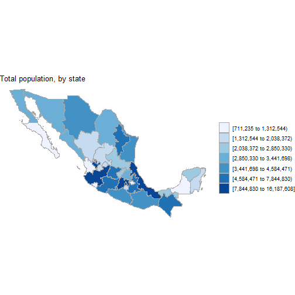

Developing Data Products Coursera Course Project: 

========================================================
author: Arnulfo Perez
date: May 24, 2020
autosize: true

Developing Data Products Coursera Course Project
========================================================

A Shiny App that gives statistics of Covid-19 in México. 

A Demo with the following objectives:

- Implement the full application cycle from idea to publication in a public server.
- Use open data
- Useful in the context of an actual need
- Provide user interaction using reactive code
- Use georeferenced data and maping utilities

mxmaps package
========================================================

The app is based on the [mxmaps package](https://github.com/diegovalle/mxmaps). This package is based on choroplethr and can be used to create maps of Mexico at both the state and county levels. It is based on [Leaflet](https://leafletjs.com/) and open data from [INEGI](http://en.www.inegi.org.mx/servicios/datosabiertos.html)



Up-to-date data on the spread of Covid-19
========================================================

The application uses [data published daily by the mexican government](https://www.gob.mx/salud/documentos/datos-abiertos-152127)


```
tibble [219,164 x 35] (S3: spec_tbl_df/tbl_df/tbl/data.frame)
 $ FECHA_ACTUALIZACION: Date[1:219164], format: "2020-05-24" "2020-05-24" ...
 $ ID_REGISTRO        : chr [1:219164] "1607b3" "1e732c" "03f6dd" "098a35" ...
 $ ORIGEN             : num [1:219164] 2 2 2 2 2 2 2 2 2 2 ...
 $ SECTOR             : num [1:219164] 3 4 4 4 4 4 4 4 4 4 ...
 $ ENTIDAD_UM         : chr [1:219164] "27" "09" "09" "02" ...
 $ SEXO               : num [1:219164] 2 2 1 2 2 1 2 1 1 1 ...
 $ ENTIDAD_NAC        : chr [1:219164] "27" "30" "09" "25" ...
 $ ENTIDAD_RES        : chr [1:219164] "27" "15" "15" "02" ...
 $ MUNICIPIO_RES      : chr [1:219164] "004" "058" "058" "004" ...
 $ TIPO_PACIENTE      : num [1:219164] 1 1 1 2 1 1 2 2 2 1 ...
 $ FECHA_INGRESO      : Date[1:219164], format: "2020-05-13" "2020-04-14" ...
 $ FECHA_SINTOMAS     : Date[1:219164], format: "2020-05-07" "2020-04-10" ...
 $ FECHA_DEF          : Date[1:219164], format: NA NA ...
 $ INTUBADO           : num [1:219164] 97 97 97 2 97 97 2 2 2 97 ...
 $ NEUMONIA           : num [1:219164] 2 2 2 1 2 2 2 2 2 2 ...
 $ EDAD               : num [1:219164] 44 43 55 47 52 38 59 67 36 38 ...
 $ NACIONALIDAD       : num [1:219164] 1 1 1 1 1 1 1 1 1 1 ...
 $ EMBARAZO           : num [1:219164] 97 97 2 97 97 2 97 2 2 2 ...
 $ HABLA_LENGUA_INDIG : num [1:219164] 2 2 2 2 2 2 2 2 2 2 ...
 $ DIABETES           : num [1:219164] 2 2 1 2 1 2 2 1 2 2 ...
 $ EPOC               : num [1:219164] 2 2 2 2 2 2 2 2 2 2 ...
 $ ASMA               : num [1:219164] 2 2 2 2 2 2 2 1 2 2 ...
 $ INMUSUPR           : num [1:219164] 2 2 2 2 2 2 2 2 2 2 ...
 $ HIPERTENSION       : num [1:219164] 2 2 1 2 2 2 2 2 2 2 ...
 $ OTRA_COM           : num [1:219164] 2 2 2 2 1 2 2 2 2 2 ...
 $ CARDIOVASCULAR     : num [1:219164] 2 2 2 2 2 2 2 2 2 2 ...
 $ OBESIDAD           : num [1:219164] 2 1 1 2 2 2 2 2 2 2 ...
 $ RENAL_CRONICA      : num [1:219164] 2 2 2 2 2 2 2 2 2 2 ...
 $ TABAQUISMO         : num [1:219164] 2 2 2 2 2 2 2 2 2 2 ...
 $ OTRO_CASO          : num [1:219164] 1 99 99 99 99 99 99 99 99 99 ...
 $ RESULTADO          : num [1:219164] 1 1 1 1 1 1 1 1 1 1 ...
 $ MIGRANTE           : num [1:219164] 99 99 99 99 99 99 99 99 99 99 ...
 $ PAIS_NACIONALIDAD  : chr [1:219164] "México" "México" "México" "México" ...
 $ PAIS_ORIGEN        : num [1:219164] 99 99 99 99 99 99 99 99 99 99 ...
 $ UCI                : num [1:219164] 97 97 97 1 97 97 2 2 2 97 ...
 - attr(*, "problems")= tibble [208,735 x 5] (S3: tbl_df/tbl/data.frame)
  ..$ row     : int [1:208735] 1 2 3 5 6 7 8 9 10 11 ...
  ..$ col     : chr [1:208735] "FECHA_DEF" "FECHA_DEF" "FECHA_DEF" "FECHA_DEF" ...
  ..$ expected: chr [1:208735] "valid date" "valid date" "valid date" "valid date" ...
  ..$ actual  : chr [1:208735] "9999-99-99" "9999-99-99" "9999-99-99" "9999-99-99" ...
  ..$ file    : chr [1:208735] "<connection>" "<connection>" "<connection>" "<connection>" ...
 - attr(*, "spec")=
  .. cols(
  ..   FECHA_ACTUALIZACION = col_date(format = ""),
  ..   ID_REGISTRO = col_character(),
  ..   ORIGEN = col_double(),
  ..   SECTOR = col_double(),
  ..   ENTIDAD_UM = col_character(),
  ..   SEXO = col_double(),
  ..   ENTIDAD_NAC = col_character(),
  ..   ENTIDAD_RES = col_character(),
  ..   MUNICIPIO_RES = col_character(),
  ..   TIPO_PACIENTE = col_double(),
  ..   FECHA_INGRESO = col_date(format = ""),
  ..   FECHA_SINTOMAS = col_date(format = ""),
  ..   FECHA_DEF = col_date(format = ""),
  ..   INTUBADO = col_double(),
  ..   NEUMONIA = col_double(),
  ..   EDAD = col_double(),
  ..   NACIONALIDAD = col_double(),
  ..   EMBARAZO = col_double(),
  ..   HABLA_LENGUA_INDIG = col_double(),
  ..   DIABETES = col_double(),
  ..   EPOC = col_double(),
  ..   ASMA = col_double(),
  ..   INMUSUPR = col_double(),
  ..   HIPERTENSION = col_double(),
  ..   OTRA_COM = col_double(),
  ..   CARDIOVASCULAR = col_double(),
  ..   OBESIDAD = col_double(),
  ..   RENAL_CRONICA = col_double(),
  ..   TABAQUISMO = col_double(),
  ..   OTRO_CASO = col_double(),
  ..   RESULTADO = col_double(),
  ..   MIGRANTE = col_double(),
  ..   PAIS_NACIONALIDAD = col_character(),
  ..   PAIS_ORIGEN = col_double(),
  ..   UCI = col_double()
  .. )
```

shinydashboard
========================================================

[shinydashboard](https://rstudio.github.io/shinydashboard/) makes it easy to use Shiny to create dashboards.

There are several options to add dashboard functionality to Shiny, like [flexdashboard](https://rmarkdown.rstudio.com/flexdashboard/shiny.html) or [htmlwidgets](http://www.htmlwidgets.org/). 

I decided to use [shinydashboard](https://rstudio.github.io/shinydashboard/) because it was well documented and easy to use by a beginner like me.

Conclusions
========================================================

- Source code [here](https://github.com/ArnulfoPerez/shiny).
- Documentation [here](https://arnulfoperez.github.io/shiny/).
- Live app [here]
- I implemented a [Shiny](https://shiny.rstudio.com/) app with interactive reactive components, georeferenced data displayed on maps, and used live open data updated daily.
- I feel satisfied to have been able to develop a web app that gives up-to-date statistics of Covid-19 in México. 
